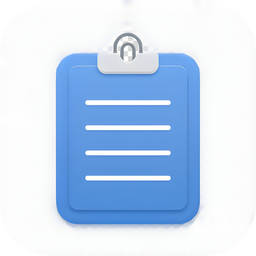
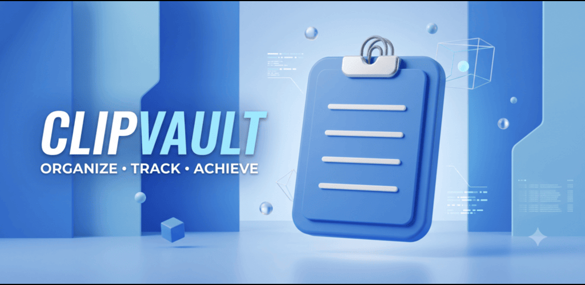

# ClipVault

<p align="left">
  
</p>

**Local-first clipboard manager for Android.** Capture, organize, search, and restore everything you copy — with zero cloud dependency.

[](https://github.com/bilboo00/ClipVault/releases/latest)
[](LICENSE)
[](https://github.com/bilboo00/ClipVault)
[](https://kotlinlang.org)
[](https://developer.android.com/jetpack/compose)
[](https://github.com/bilboo00/ClipVault/stargazers)
[](https://github.com/bilboo00/ClipVault/issues)
[](https://github.com/bilboo00/ClipVault/discussions)
[](LICENSE)

---

## Why ClipVault?

Most clipboard managers lock your data behind a subscription, track you, or send your text to the cloud. ClipVault stores **everything on-device**, in a private SQLite database — and lets you organise, transform, and lock down sensitive clips with a modern Material 3 interface.

## Features

### Capture & history
- Automatic clipboard capture with a foreground monitoring service
- Full-text search across every clip you've ever copied
- Pin important clips to prevent automatic pruning
- Smart content detection (URL, email, phone, code, JSON)
- Duplicate detection to keep your history clean

### Organisation
- **Tags** — colour-coded labels (10-color palette) for quick grouping
- **Collections** — bundle related clips into named sets
- **Notes** — attach rich Markdown notes to any clip
- **Temporary clips** — auto-expire after a time or after N uses

### Productivity
- **Text transformations** — 13 built-in transforms (uppercase, lowercase, slugify, JSON pretty-print, base64, ROT13, etc.) with live preview
- **Paste queue** — store multiple snippets and paste them in order
- **Snippets** — reusable text shortcuts with keyword expansion
- **Export** — your history as CSV, Markdown, or plain text

### Integration
- **Enhanced link previews** — OpenGraph metadata for URLs
- **Share to ClipVault** — capture text from any app via Android's share sheet
- **Deep linking** — `clipvault://` and `https://clipvault.app` URI schemes
- **Floating bubble overlay** — quick access from any screen
- **Shake-to-open** gesture
- **Home screen widget** and **Quick Settings tile**
- **Biometric lock** — protect sensitive clips with fingerprint / face unlock

### Design
- Material 3 with dynamic colour and AMOLED black
- Smooth motion and micro-interactions
- Haptic feedback tuned for each action

## Screenshots

<p align="center">
  
</p>

## Requirements

- **Android 8.0 (API 26) or higher**
- **Java 21** for building from source

## Download

Grab the latest APK from the [**Releases**](https://github.com/bilboo00/ClipVault/releases/latest) page.

## Build from source

```bash
git clone https://github.com/bilboo00/ClipVault.git
cd ClipVault

# Debug APK
./gradlew :app:assembleDebug

# Release APK
./gradlew :app:assembleRelease

# Release AAB (for Play Store)
./gradlew :app:bundleRelease
```

## Architecture

| Layer       | Stack                                                   |
|-------------|---------------------------------------------------------|
| Language    | Kotlin 2.0.20                                           |
| UI          | Jetpack Compose + Material 3                            |
| Pattern     | MVVM + Unidirectional Data Flow                         |
| DI          | Hilt with KSP                                           |
| Database    | Room (SQLite)                                           |
| Preferences | DataStore Preferences                                   |
| Concurrency | Kotlin Coroutines + Flow                                |
| Services    | Foreground, Accessibility, Tile, Bubble, Glance Widget  |

## Project structure

```
app/src/main/java/com/clipvault/manager/
├── app/              # Application and Activity entry points
├── data/             # Repository, DAO, entities, preferences, export
│   ├── export/       # CSV, Markdown, Plain Text exporters
│   ├── local/        # Room entities and DAOs
│   ├── preferences/  # DataStore-backed settings
│   ├── repository/   # Domain repositories
│   └── security/     # Biometric authentication wrapper
├── di/               # Hilt dependency injection modules
├── domain/           # Domain models and business logic
├── haptic/           # Haptic feedback utilities
├── sensor/           # Shake detection
├── service/          # Background services and receivers
├── ui/               # Compose screens, components, theme
└── widget/           # Glance home screen widget
```

## Privacy

Your clipboard never leaves your device. ClipVault:

- Stores every clip in a **private on-device SQLite database**
- Has **no analytics, tracking, or telemetry**
- Requests **no network permissions** (except optional URL title fetching via `INTERNET` for link previews)
- Requires **no account** to use

The full list of permissions, with justifications, is in [PRIVACY_POLICY.md](PRIVACY_POLICY.md).

## Contributing

Contributions are welcome! See the [open issues](https://github.com/bilboo00/ClipVault/issues) for ideas, or open a [discussion](https://github.com/bilboo00/ClipVault/discussions) to propose something new.

When you're ready to send a pull request:
1. Fork the repo and create a feature branch
2. Keep changes focused; one feature per PR
3. Match the existing code style (Kotlin official + Compose conventions)
4. Test on a device or emulator running Android 8.0+

## Roadmap

- [x] Tags & collections
- [x] Text transformations
- [x] Paste queue
- [x] Clip notes
- [x] Enhanced link previews
- [x] Share-to-ClipVault
- [x] Deep linking
- [x] Temporary clips
- [x] Biometric lock
- [x] Duplicate detection
- [x] Export formats
- [ ] Cloud sync (opt-in, E2E encrypted)
- [ ] Cross-device clipboard via LAN
- [ ] Wear OS companion

## License

Released under the [MIT License](LICENSE).

## Star history

If ClipVault is useful to you, a star helps others find it. ⭐